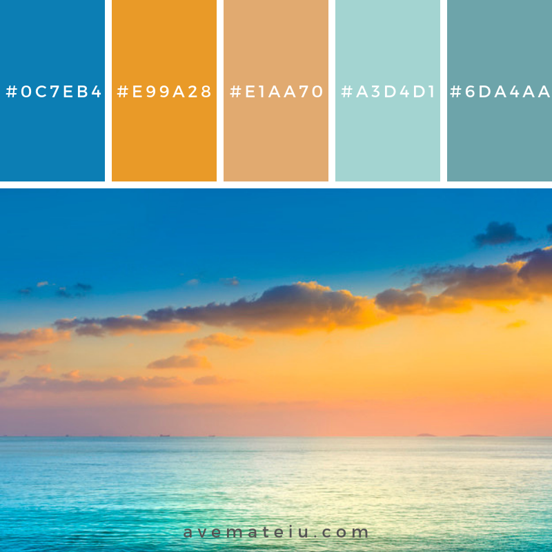
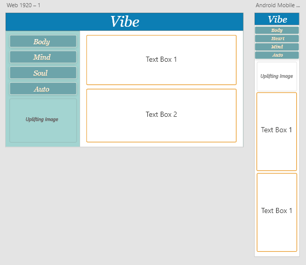

# Uplift Guide

> “Muddy water is best cleared by leaving it alone.” – Alan Watts.

This a quick guide on the inner workings of Uplift. Uplift is an interactive webpage that has been designed to aid in stress reduction.

## Usage

We all have those moments of stress in our lives; its an inevitability. Uplift comes with a simple and streamlined way to reduce stress or anxiety using a quick burst of energy, whether it be for the body, mind, or soul. Simply pick a category, sit back, relax, and let the stress melt away.

## Deployment

​https://swist92.github.io/project1vibe/

## Visual Style Guide

Color palette

Mobile and Browser views

## Contributors

Sarah W., Jeremy F., Russell S., Donald H.

## Thanks to

Photo by Edgar Chaparro on Unsplash
